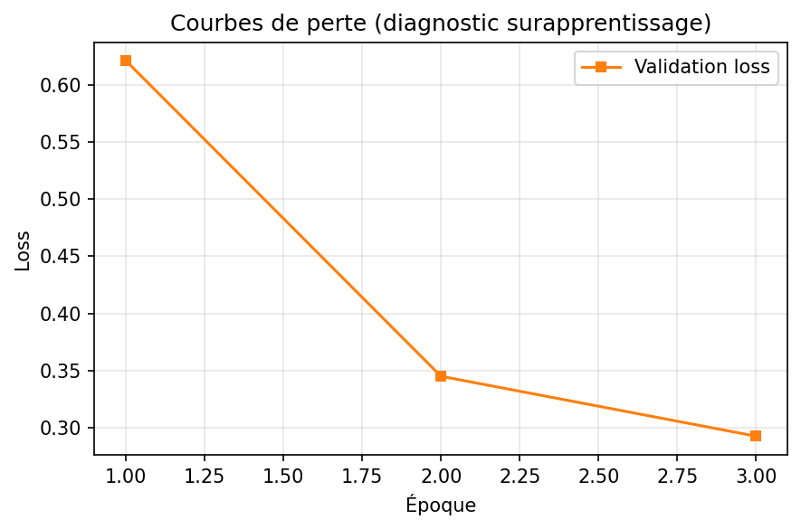
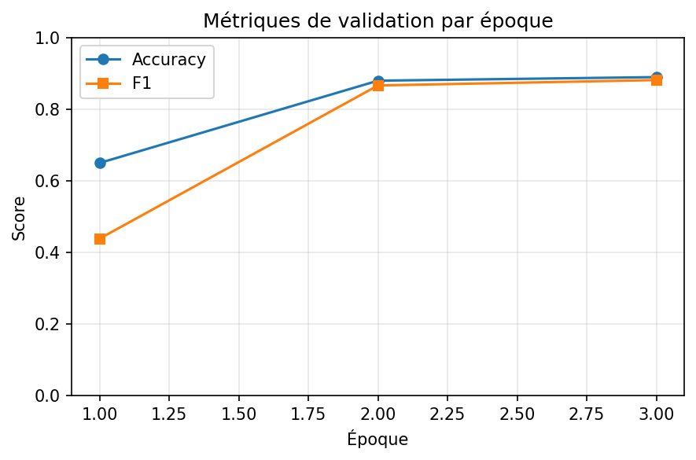
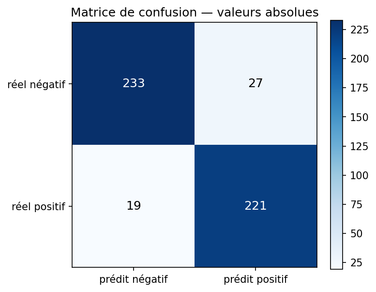
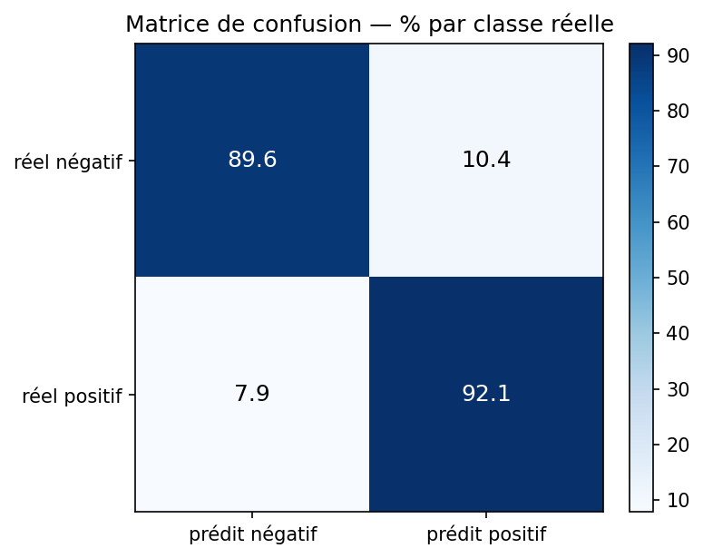
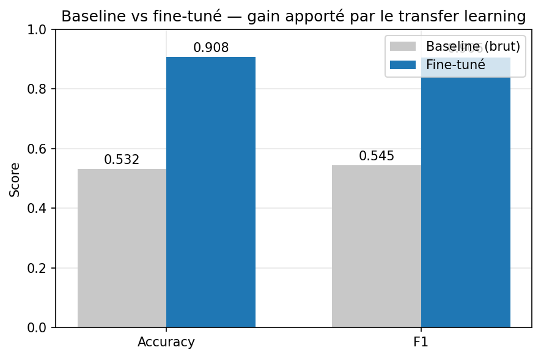

# AvisSense

Projet réalisé dans le cadre du module **M106 – Introduction au Machine Learning et Deep Learning**.

## Sujet choisi

Analyse de sentiment d'avis en français à partir d'avis de cinéma.

## Objectif

L'utilisateur saisit ou colle un avis en français. L'application indique ensuite si cet avis est plutôt **positif** ou **négatif**, avec un **niveau de confiance**.

## Démo en ligne

| Ressource | Lien |
|---|---|
| 🖥️ Application (frontend React) | https://avis-sense.vercel.app |
| ⚙️ API FastAPI (Space Docker) | https://stive-g-avissense.hf.space/docs |
| 🤖 Modèle fine-tuné (Hub) | https://huggingface.co/Stive-G/avissense-distilcamembert |

> La première requête après une période d'inactivité peut prendre ~30 s (réveil du Space et chargement du modèle) ; `GET /health` indique si le modèle est prêt.

## Technologies utilisées

- Python
- PyTorch
- Hugging Face Transformers
- Dataset Allociné
- FastAPI
- Gradio
- Hugging Face Spaces

## Dataset

Le projet utilise le dataset **Allociné** disponible sur le Hugging Face Hub.  
Il contient des avis de films en français avec deux classes :

- `0` : négatif
- `1` : positif

## Modèle retenu

Le modèle utilisé est **DistilCamemBERT** (`cmarkea/distilcamembert-base`).

| Modèle | Langue | Paramètres | Vitesse | Pertinence ici |
|---|---|---|---|---|
| CamemBERT-base | français | 110M | 1× | excellent mais 2× plus lent à servir sur CPU |
| **DistilCamemBERT** ✅ | français | 68M | ~2× | ~97 % de la performance de CamemBERT |
| DistilBERT multilingual | 104 langues | 134M | ~1.5× | capacité diluée, tokenisation du français moins bonne |

Ce choix permet de conserver un modèle spécialisé français tout en restant assez léger pour être servi sur le CPU gratuit de Hugging Face Spaces, sans perte notable sur une tâche binaire.

## Principe ML / DL

Le projet repose sur le **transfer learning** :

- on part d'un modèle déjà pré-entraîné sur du texte français ;
- on réalise ensuite un **fine-tuning** sur des avis Allociné ;
- le modèle apprend ainsi à distinguer les avis positifs des avis négatifs dans le domaine du cinéma.

Deux stratégies sont implémentées dans l'entraînement (décision « architect » du sujet) :

- **fine-tuning complet** (par défaut) : les 68M de paramètres sont ajustés avec un learning rate très faible (2e-5) ;
- **gel du backbone** (`--freeze-backbone`) : seule la tête de classification (~1 % des paramètres) est entraînée, le reste du modèle sert d'extracteur de features figé.

**Décision retenue : le fine-tuning complet.** Le gel ne fait économiser que du temps d'*entraînement* (le coût d'inférence est identique) et coûte plusieurs points de F1, car les représentations génériques du pré-entraînement ne sont pas adaptées au vocabulaire des critiques de cinéma. Chaque run écrit ses hyperparamètres et résultats dans `model/sentiment_model/training_metrics.json` (champ `strategy`), ce qui permet de comparer les deux stratégies chiffres à l'appui :

```bash
python scripts/train.py                                      # stratégie A : fine-tuning complet
python scripts/train.py --freeze-backbone --learning-rate 1e-3   # stratégie B : tête seule
```

## Ce que fait l'utilisateur

1. Il écrit ou colle un avis de film en français.
2. Il lance l'analyse.
3. L'application affiche :
   - le sentiment prédit ;
   - le niveau de confiance ;
   - un retour simple et lisible.

## Architecture du projet

```text
AvisSense/
├── api/                    # API FastAPI
├── figures/                # Graphiques de métriques (générés, versionnés)
├── frontend/               # Frontend React pour Vercel
├── model/                  # Modèle entraîné en local
├── scripts/                # Entraînement, évaluation, prédiction, figures, publication
├── src/                    # Logique partagée d'inférence et utilitaires
├── tests/                  # Tests unitaires
├── app.py                  # Interface Gradio
├── Dockerfile              # Déploiement Hugging Face Spaces
└── README.md
```

## Scripts principaux

- `python scripts/train.py`
  - entraîne le modèle et sauvegarde les poids dans `model/sentiment_model`
- `python scripts/evaluate.py`
  - évalue le modèle sur le jeu de test
- `python scripts/predict.py "Ce film est magnifique"`
  - lance une prédiction en ligne de commande
- `uvicorn api.main:app --reload`
  - démarre l'API FastAPI
- `python app.py`
  - lance l'interface Gradio
- `python scripts/generate_metrics_plots.py --max-test 500`
  - génère les 5 graphiques de métriques dans `figures/` (voir section Figures)
- `python scripts/push_model_to_hub.py --repo utilisateur/avissense-distilcamembert`
  - publie le modèle sur le Hugging Face Hub

## Résultats obtenus

Sur un test réduit de **500 avis**, un entraînement a produit les métriques suivantes :

- accuracy : `0.9100`
- precision : `0.9012`
- recall : `0.9125`
- f1 : `0.9068`

Matrice de confusion observée :

```text
                 |  prédit négatif |  prédit positif
----------------------------------------------------
    vrai négatif |             236 |              24
    vrai positif |              21 |             219
```

Ces résultats montrent que le modèle est déjà solide sur une configuration d'entraînement courte.

## Figures

Les graphiques ci-dessous sont générés par `python scripts/generate_metrics_plots.py` et versionnés dans `figures/`. Ils proviennent d'un run d'illustration en configuration légère (`--max-train 500 --epochs 3`, évaluation sur 500 avis du test set) — le but est de montrer la dynamique d'entraînement et le comportement du modèle, pas le score maximal atteignable.

### 1. Courbes de perte (diagnostic du surapprentissage)



La **training loss** doit descendre au fil des époques : le modèle apprend. Si la **validation loss** remonte alors que la training loss continue de baisser, le modèle mémorise le jeu d'entraînement au lieu de généraliser — c'est le surapprentissage (overfitting). C'est ce graphique qui justifie de s'arrêter à 2-3 époques en fine-tuning.

### 2. Métriques de validation par époque



L'accuracy et le F1 mesurés sur la validation à la fin de chaque époque. Le meilleur checkpoint (selon le F1) est automatiquement conservé par l'entraînement (`load_best_model_at_end`).

### 3-4. Matrices de confusion (test set)




La diagonale = les bonnes prédictions ; hors diagonale = les erreurs. La version en **% par classe réelle** permet de vérifier que le modèle est **équilibré** : un taux de réussite similaire sur les avis négatifs et positifs, sans biais vers une classe.

### 5. Baseline vs fine-tuné — le gain du transfer learning



La **baseline** est le même DistilCamemBERT avec sa tête de classification **non entraînée** : elle répond au niveau du hasard (~50 % sur deux classes équilibrées). L'écart entre les deux barres mesure exactement ce que le fine-tuning apporte — c'est la justification chiffrée du choix « transfer learning » du projet.

Pour régénérer les figures (nécessite un modèle entraîné dans `model/sentiment_model`) :

```bash
python scripts/generate_metrics_plots.py --max-test 500
```

> Les figures 1-2 nécessitent `model/sentiment_model/training_history.json`, écrit par `train.py` pendant l'entraînement.

## Limites du modèle

- Le modèle est entraîné sur des **avis de cinéma** : ses performances peuvent baisser hors de ce domaine.
- La classification est **binaire** : il n'y a pas de classe neutre.
- L'ironie, le sarcasme et les avis très ambigus restent difficiles.
- Le score de confiance est utile pour l'interprétation, mais il ne garantit pas une certitude absolue.
- Les textes très longs sont tronqués à `256` tokens.

## Lancement local

Créer un environnement virtuel puis installer les dépendances :

```bash
uv venv
uv pip install -r requirements.txt
```

Exemples de commandes utiles :

```bash
python scripts/train.py --max-train 2000 --max-val 500 --max-test 500 --epochs 1
python scripts/evaluate.py --max-test 500
python scripts/predict.py "Ce film est magnifique"
uvicorn api.main:app --reload
python app.py
```

## Déploiement

### Hugging Face

Le projet peut être déployé sur **Hugging Face Spaces** :

- le code de l'application part sur le Space ;
- le modèle entraîné est publié sur le **Hugging Face Hub** ;
- la variable `MODEL_ID` permet au Space de charger le bon modèle.

### Vercel

Le frontend React peut être déployé séparément sur **Vercel** :

- `Root Directory` : `frontend`
- `Framework Preset` : `Vite`
- variable d'environnement :
  - `VITE_API_BASE_URL=https://votre-space.hf.space`

## API

Route principale de prédiction :

```text
POST /predict
```

Exemple de corps :

```json
{ "text": "Ce film est incroyable" }
```

Exemple de réponse :

```json
{
  "label": "positif",
  "confidence": 0.9812,
  "probabilities": {
    "négatif": 0.0188,
    "positif": 0.9812
  },
  "processing_time_ms": 47.3
}
```

## Remarque

`src/inference.py` charge le modèle :

- depuis `MODEL_ID` si la variable d'environnement est définie ;
- sinon depuis `model/sentiment_model` en local.
